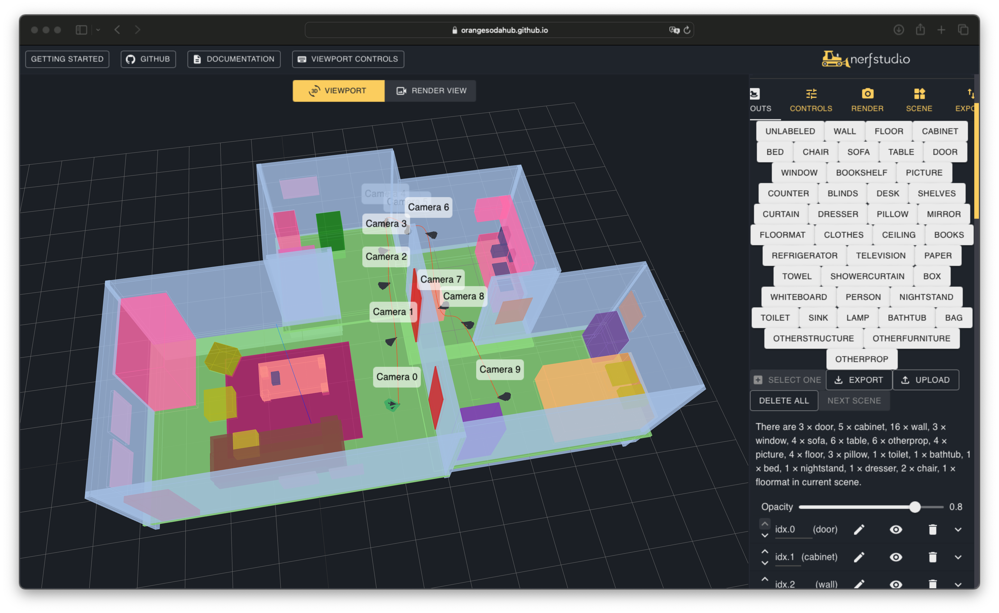

# SceneCraft: Layout-Guided 3D Scene Generation

<a href="https://github.com/OrangeSodahub" style="color:blue;">Xiuyu Yang*</a> ·
<a href="https://yunzeman.github.io/" style="color:blue;">Yunze Man*</a> ·
<a href="https://scholar.google.com/citations?user=_m5__wUAAAAJ" style="color:blue;">Jun-Kun Chen</a> ·
<a href="https://yxw.web.illinois.edu/" style="color:blue;">Yu-Xiong Wang</a>

**[NeurIPS 2024]** [[`Project Page`](https://orangesodahub.github.io/SceneCraft/)] [[`arXiv`](http://arxiv.org/abs/2410.09049)] [[`pdf`](https://arxiv.org/pdf/2410.09049)] [[`BibTeX`](#BibTex)] [[`License`](https://github.com/OrangeSodahub/SceneCraft?tab=MIT-1-ov-file)]


## About
### TL;DR We generate complex 3D scenes conditioned on <span style="color: red">free-form layout</span> and <span style="color: red">viewpoints</span>.


We introduce SceneCraft, an innovative framework for generating complex, detailed indoor scenes from textual descriptions and spatial layouts. By leveraging a rendering-based pipeline, and a layout-conditioned diffusion model, our work effectively converts 3D semantic layouts into multi-view 2D images and learns a final scene representation that is not only consistent and realistic but also adheres closely to user specifications. Please check out project page and paper for more details. The open-source release of our code and dataset promises to further empower research and development in this exciting domain. <br><br>


## BibTeX
If you find our work useful in your research, please consider citing our paper:
```bibtex
@inproceedings{yang2024scenecraft,
      title={SceneCraft: Layout-Guided 3D Scene Generation},
      author={Yang, Xiuyu and Man, Yunze and Chen, Jun-Kun and Wang, Yu-Xiong},
      booktitle={Advances in Neural Information Processing Systems},
      year={2024} 
}
```

## Environment Setup

Clone and setup nerfstudio (better follow the version specified below).

**Tips**: Follow the [tutorials](https://docs.nerf.studio/quickstart/first_nerf.html) of nerfstudio to verify the environment.

```bash
# install nerfstudio
pip install nerfstudio==0.3.4

# setup scenecraft
git --recurse-submodules clone https://github.com/OrangeSodahub/SceneCraft.git

cd SceneCraft/
pip install [-e] .
```

Tested environment is python3.9/3.10, torch2.0.1+cu117/118.


## Train Diffusion Model

**Tips**: We host our finetuned diffusion models at ([SD-Scannet++](https://huggingface.co/gzzyyxy/layout_diffusion_scannetpp_prompt_one_hot_multi_control_bs32_epoch18)) ([SD-Hypersim](https://huggingface.co/gzzyyxy/layout_diffusion_hypersim_prompt_one_hot_multi_control_bs32_epoch24)).

Before training, download the raw data and processed them into layout data.

- For Scannet++, download from [here](https://kaldir.vc.in.tum.de/scannetpp/) and complete the image distortion and downscale for dslr images;
- For Hypersim, download from [here](https://github.com/apple/ml-hypersim/blob/main/code/python/tools/dataset_download_images.py).

**Tips**: We host our processed layout data at ([Data-Scannet++](https://huggingface.co/datasets/gzzyyxy/layout_diffusion_scannetpp_voxel0.2)) ([Data-Hypersim](https://huggingface.co/datasets/gzzyyxy/layout_diffusion_hypersim)) which are used to train diffusion model, use it to skip following steps.

Run the following script to convert preprocessed data to layout data (check data path used in bash file):

```bash
bash scripts/prepare_dataset.sh \
      $DATASET                # choose from [Scannetpp, Hypersim]
      $LIMIT                  # limit number of images per scene, set to 100
      $GPUS                   # number of gpus to use
      [--split]               # choose from ['train', 'val', 'all] for scannet++
      [--save-depth]          # store True, whether to save depth maps
      [--voxel-size]          # for scannet++ voxelization, set to 0.2; no use no voxelization
```

Generate JSONL data for efficient use of training (keep same settings as above):

```bash
bash scripts/generate_json.sh $DATASET $LIMIT [--voxel-size]
```

The expected well-perpared data (e.g. scannet++) structure of directory:

```text
data
├── scannetpp
|   ├── data
|   |   ├── SCENE_ID0
|   |   |   ├── dslr
|   ├── ... ...
├── scannetpp_processed
|   ├── data # same structure as scannetpp/data/
|   ├── scannetpp_instance_data
|   ├── [voxel_data] # optional
|   ├── semantic_data
|   |   ├── SCENE_ID0
|   |   |   ├── IMAGE_ID0.png
|   |   |   ├── IMAGE_ID0.npz
|   ├── ... ...
```

Run the following script to train controlnets model (check model and data paths used in bash file):

```bash
bash scripts/train_controlnet_sd.sh \
      $DATASET                      # choose from [Scannetpp, Hypersim]
      [--condition_type]            # default one_hot
      [--conditioning_channels]     # default 8, should be less than 16
      [--enable_depth_cond]         # use depth condition
      [--controlnet_conditioning_scale]  # control factor of controlnet, e.g., 3.5 1.5
      [--resume_from_checkpoint]    # e.g. latest or .../checkpoint-1000
      [--report_to]                 # e.g. wandb

# an example:
bash scripts/train_controlnet_sd.sh hypersim --condition_type one_hot --conditioning_channels 8 --enable_depth_cond --controlnet_conditioning_scale 3.5 1.5
```

## Train SceneCraft Model

We use nerfacto from nerfstudio as the scene models. To generate a scene:
1) get its raw data (bounding boxes, labels and cameras);
2) get its layout data (semantic/depth images and jsonl file);
3) train its scene model.

**Step1**: this step is only needed for **scene layout drawn by ourselves**.

Use this [webgui](https://orangesodahub.github.io/nerfstudio/) to draw your own layout, then export the layout and camera data files to `ROOT/data/custom/(scene_id)/` which should be:

```text
data
├── custom
|   ├── (scene_id)
|   |   ├── cameras.json
|   |   ├── layout.json
```

The interface is adapted from nerfstudio viewer, where developers could put/remove/edit objects/cameras. Click `EXPORT` to save layouts/cameras to `.json` files. (For those who want more customizations, source code of this interface is at `thirdparty/nerfstudio/nerfstudio/viewer_legacy`)


**Step2**: run the following script to get layout data from raw data:

```bash
bash scripts/generate_outputs.py \
      --layout            # to specify the output type
      --dataset           # choose from ['scannetpp', 'hypersim', 'custom']
      --scene_id          # scene_id
      --output_dir        # default outputs
```

**Step3**: *(More specific instructions will be provided)*
More training details could be found in Supp. (Sec.A) of our paper. This training step requires at least **TWO** GPUs (check Appendix Sec.A of our paper).

Check the configurations at `scenecraft/configs/method` and run the following script:

```bash
# set RECORD to track results via wandb
# set DEBUG to log more detaild infos and for debugging
[RECORD=1] [DEBUG=1] ns-train ${method_name} [--machine.num-devices ${num_gpus}]
```

We will provide more details and release layout data examples/scene models soon.

## Visualization

We provide comprehensive visualization scripts at `scripts/generate_outputs.py`, which supports 5 keywords: layout, diffusion, nerf, mesh, point.

1. To visualize the rendered layout data, please set `--layout` as below:

```bash
python scripts/generate_outputs.py --layout --dataset $DATASET --scene_id $SCENE_ID [--voxel_size $VOXEL_SIZE]

# an example
python scripts/generate_outputs.py --layout --dataset hypersim --scene_id ai_001_005
```

2. To visualize the generations of 2d diffusion model, please set  `--diffusion`:

```bash
python scripts/generate_outputs.py --diffusion --dataset $DATASET --scene_id $SCENE_ID --prompt $PROMPT \
            [--base_model_path] \  # please refer to source code for more details
            [--checkpoint_path] \
            [--checkpoint_subfolder] \

# an example
python scripts/generate_outputs.py --diffusion --dataset hypersim --scene_id ai_001_005 --prompt "This is a bedroom painted by Van Gogh."
```

3. To visualize the rendering results of trained nerf model, please set `--nerf`:

```bash

python scripts/generate_outputs.py --nerf --dataset $DATASET --scene_id $SCENE_ID --load_config $PATH_TO_YML_FILE

# an example
python scripts/generate_outputs.py --nerf --dataset hypersim --scene_id ai_001_005 --load_config ROOT/outputs/xxx/xxx.yml
```

## TODO

- [x] Release detailed instructions for generation and visualization
- [ ] Release layout examples
- [x] Release training code
- [x] Instructions for preparing data


## Acknowledgement

Thansk for these excellent opensource works: [nerfstudio](https://github.com/nerfstudio-project/nerfstudio); [diffuser](https://github.com/huggingface/diffusers).
